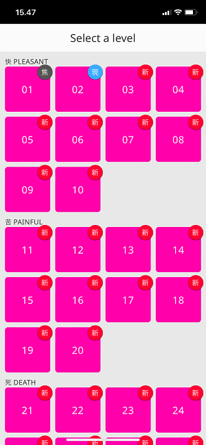
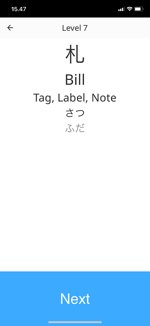

# WaniKani Kanji Pratice
Review tool for all Japanse kanji characters taught by the [WaniKani](http://www.wanikani.com) course.

 

## Where does the data come from?
The data for each level has been extracted using the [WaniKani API](https://docs.api.wanikani.com). The response was then trimmed using [JMESPath](https://jmespath.org) to only include the necessary fields. These are then stored as json files which are read and parsed by the app.

## Try it out 🚀
The project is hosted on Vercel: [flutter-wanikani.vercel.app](https://flutter-wanikani.vercel.app)
